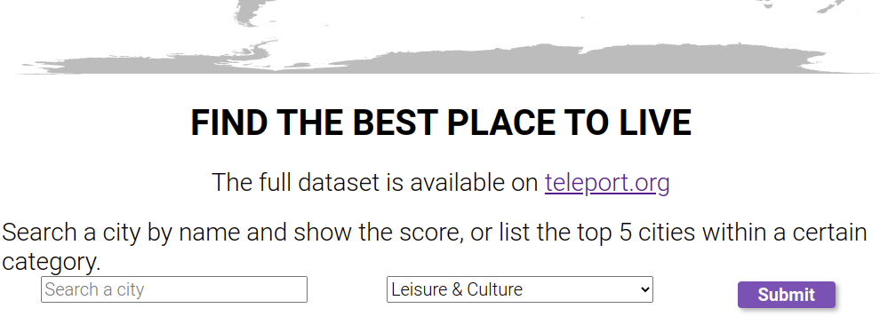

[![Issues][issues-shield]][issues-url]
[![LinkedIn][linkedin-shield]][linkedin-url]

<!-- PROJECT LOGO -->
<br />
<div align="center">
  
  <h3 align="center">Quality of Life</h3>
  <p align="center">Project created for <strong>Start2Impact</strong> course: <em>Javascript Advanced</em></p>
</div>

### Built With

* [HTML 5](https://developer.mozilla.org/en-US/docs/Glossary/HTML)
* [CSS 3](https://developer.mozilla.org/en-US/docs/Web/CSS)
* [Javascript](https://developer.mozilla.org/en-US/docs/Web/JavaScript?retiredLocale=it)
* [Webpack 5](https://webpack.js.org/blog/2020-10-10-webpack-5-release/)

<!-- TABLE OF CONTENTS -->
<details open="open">
  <summary>Table of Contents</summary>
  <ol>
    <li><a href="#getting-started">Getting Started</a></li>
    <li><a href="#usage">Usage</a></li>
    <li><a href="#contact">Contact</a></li>
  </ol>
</details>


<!-- GETTING STARTED -->
## Getting Started

1. Clone the repo

```sh
git clone git@github.com:matteorazzanelli/qol-js-app.git
```

2. Launch `index.html` with your favorite browser.

<!-- USAGE -->
## Usage

Il sito ti permette di trovare il miglior posto dove vivere in base alle tue esigenze.
- Digita una città nell’apposito campo
- Sottometti la richiesta al sistema e aspetta per la risposta
- Visualizza la o le città corrispondenti alla tua chiave di ricerca
- Scegli su quale città fare il focus
- Visualizza quanto quella città è vivibile in base ai criteri esistenti in un punteggio da 0 a 10


<!-- CONTACT -->
## Link & Contact

Matteo Razzanelli - matteo.razzanelli89@gmail.it

Start2impact personal page - https://talent.start2impact.it/profile/matteo-razzanelli

Project Repository: [Quality of Life](https://github.com/matteorazzanelli/qol-js-appp)

Project Website:  [Quality of Life - Firebase](https://qol-js-web-app.web.app/)

<!-- MARKDOWN LINKS & IMAGES -->
[issues-shield]: https://img.shields.io/github/issues/matteorazzanelli/qol-js-app/repo.svg?style=for-the-badge
[issues-url]: https://github.com/matteorazzanelli/qol-js-app/issues
[linkedin-shield]: https://img.shields.io/badge/-LinkedIn-black.svg?style=for-the-badge&logo=linkedin&colorB=555
[linkedin-url]: https://www.linkedin.com/in/matteo-razzanelli/